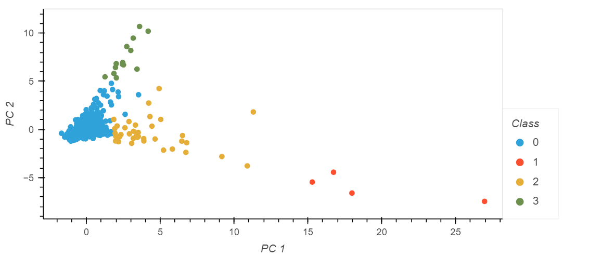
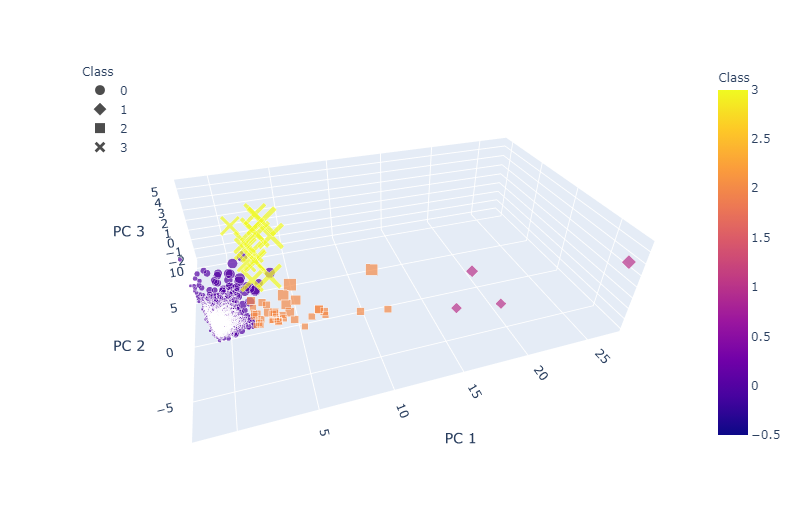

# Sleeper Cities

[Powerpoint synopsis](https://github.com/marke0816/Sleeper_Cities/blob/main/Resources/Sleeper_Cities_Analysis.pptx) available on *Resources* folder. 

## *Group*

Elard Yong, Joseph Worland, Ryan Meredith, Mark Esposito

## *Objective*

The goal of this repository is to use machine learning to identify cities which are potentially primed for real estate and population growth similar to the likes of which Austin, TX has seen.  Large groups of people working from home while living in high cost-of-living areas are choosing to take their disproportionately large incomes (compared to those incomes in lower cost of living areas) to areas which have similar standards of living with a much lower cost of living.  The southern part of the United States has seen unprecedented growth in the past few years, and our goal is to use machine learning to determine which cities, similar to Austin, TX, are likely to see booms in population growth.

## *Communication Protocol*

Our group communicates mainly through our slack direct messages.  We also share data and ideas through a google drive set up by Elard.  Joseph has also set up a recurring zoom meeting for every day at 11 am CST so that we may discuss our project.

## *Data Sources*

The data we have collected so far has come from a few different sources.  The weather data was downloaded from kaggle, the housing data was provided by realtor.com which displays all MLS listed properties across the country, and the income and population data came from census.gov.

## *Data Storage*

The data collected from the sources mentioned above get stored as *.csv* files on a local repository. Utilizng the [*"mongo_data_uploader"*](https://github.com/marke0816/Sleeper_Cities/blob/main/jupyter_notebooks/mongo_data_uploader.ipynb) jupyter notebook*, the raw datasets gets uploaded as a collection onto a shared MongoDB cluster via PyMongo. This operation allows users to access the raw data and run the [*"sleeper_cities"*](https://github.com/marke0816/Sleeper_Cities/blob/main/jupyter_notebooks/Sleeper_cities.ipynb) *juyter notebook* from their computer in order to extract, transform, and load it into the *Machine Learning* model.

## *The Machine Learning Models*

### ***Kmeans Clustering***:

We have chosen to run Kmeans clustering as a first pass.  The images shown below depict the clustering labels with K = 5.  This Kmeans clustering is performed only on the housing data so far.  We plan to merge all collected datasets we have into one dataframe, allowing us to use all the features we have at our disposal to make the ML model more robust.

The K-value was chosen using the elbow curve below

### ***Affinity Propagation***:

Sticking with clustering we ran an additional sklearn algorithm. The unique feature of this clustering method is that Affinity Propagation (AP) does not require the user to set a specific cluster number, but instead infer its own number of clusters by sending messages back and forth between data points to determine the association with each data point. So far, this method has yielded a greater number of clusters but has also narrowed our scope of potential cities. 

### ***Hierarchical Agglomerative Clustering***:

Lastly, we are attempting the Hierarchical Agglomerative Clustering (HAC) model, which is an alternate clustering method that like AP will turn each data point into an individual cluster, but unlike AP, it will take the two closest clusters and combine them into one cluster, repeating this step until all data is grouped into one final cluster. Using a dendrogram to visually inspect the largest vertical distance we then determine the optimal number of clusters for the HAC model. 

