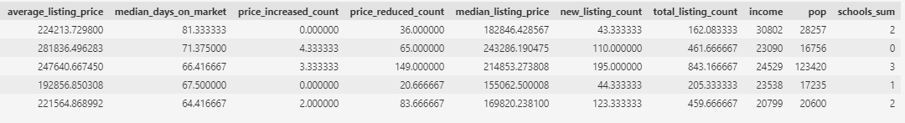
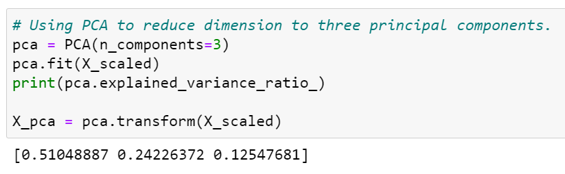
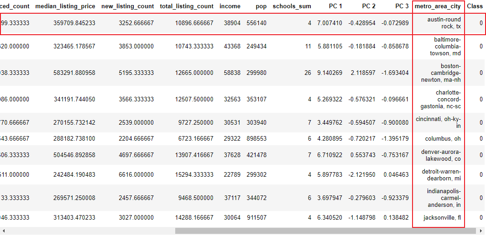

# Sleeper Cities

[Powerpoint synopsis](https://github.com/marke0816/Sleeper_Cities/blob/main/Resources/Sleeper_Cities_Analysis.pptx) available on *Resources* folder.

## *Group*

Elard Yong, Joseph Worland, Ryan Meredith, Mark Esposito

## *Objective*

The goal of this repository is to use machine learning to identify cities which are potentially primed for real estate and population growth similar to the likes of which Austin, TX has seen.  Large groups of people working from home while living in high cost-of-living areas are choosing to take their disproportionately large incomes (compared to those incomes in lower cost of living areas) to areas which have similar standards of living with a much lower cost of living.  The southern part of the United States has seen unprecedented growth in the past few years, and our goal is to use machine learning to determine which cities, similar to Austin, TX, are likely to see booms in growth.

## *Communication Protocol*

Our group communicates mainly through our slack direct messages. We also notify each other when the main branch of our GitHub is updated so we can pull the newest version of code to our individual branches.  We also share data and ideas through a google drive set up by Elard.  Joseph has also set up a recurring zoom meeting for every day at 11 am CST so that we may discuss our project.  

## *Data Sources*

The data we have collected so far has come from a few different sources.  The weather data was downloaded from kaggle, the housing data was provided by realtor.com which displays all MLS listed properties across the country, and the income and population data came from census.gov.

## *Data Exploration*

When exploring the raw data for housing information we came across a massive amount of data. For example, the raw housing data contained over 55,000 rows and 40 columns. We took that down to 917 rows and 11 columns. While looking at the data we realized that the roughly 55,000 rows were monthly data points for over 5 years for 917 cities. We cleaned it up to just the year 2019 for those 917 cities as that was the last full year prior to the pandemic. Next we dropped columns that were deemed not necessary for machine learning purposes. We then created a separate data file with the cities, average income, and population. The income and population data was hard coded from the United States census. Once these dataframes were cleaned, they were joined using **pgAdmin**. Finally the weather dataset was sorted in multiple series of .CSV files that contained various weather features at weather stations. After the individual files are incorporated into a single dataset we will do another join using pgAdmin to create the final dataset to feed the machine learning models. 

## *Data Storage & Pipeline*

The data collected from the sources mentioned above gets stored as*.csv* on a local directory to later be uploaded into *AWS S3* buckets. 

Using a *boto3* connection we read the *.csv* raw data files into our [aws_sleeper_cities](https://github.com/marke0816/Sleeper_Cities/blob/triangle/jupyter_notebooks/aws_sleeper_cities.ipynb) Jupyter notebook as *Panda dataframes* in order to start cleaning the data and preparing the *housing, income, population, and weather* datasets to be merged. 

Separately, we have created an *AWS RDS* that allows us to store the database on the cloud to later be retrieved using *Postgres* using a SQLAlquemy [psycopg2](https://www.psycopg.org/docs/) connection using the following host address:  sleeper-cities-db.c5kluwhs2m0u.us-east-2.rds.amazonaws.com. 

Here is a snapshot of the connection established with our Database. 

Once the tables get loaded into the *Postgres Databases*, we proceed to join the tables in order to come up with our final database *(housing_income_pop_data)* that’ll be used for our machine learning model. (screenshot below) 

Here is a screenshot of the Entity relationship diagram that explains the relationship between data we’ll be working with.  

Finally, the Postgres database get loaded back into our [aws_sleeper_cities](Jupyter Notebook link) Jupyter notebook as *Panda dataframes* in order to be uploaded into our machine learning model. 

## *The Machine Learning Models*

To help us answer our question previously stated in the Objective, a consensus was made that we would select data sets (i.e. **housing**, **income**, **population**, and **weather**) which contain attributes that are considered major influences in determining where people ideally like to settle. The image below shows the specific features of housing along with income and population we have used in our ML model thus far. 

  

In order to prevent any of the input variables skewing the model, we performed **StandardScaler** (see below image) to standardize the values of the dataset. 

Next we pass the standardized values into **Principal Component Analysis** (PCA) in order to transform the data from high dimensionality to low dimensionality so we can visually inspect the class output while maintaining meaningful properties of the standardized dataset. (See image below for PCA code)

     

Because the input data is unlabeled and a cluster refers to a collection of data points aggregated together based on certain similarities it was settled that *unsupervised* clustering would yield the desired outcome as we were looking for cities with similarities to Austin. Two different kinds of **Scikit Learn** methods with slightly different characteristics, related to clustering, were implemented and tested. The below descriptions include limitations and benefits as well as 2D, 3D images, and labels generated by the respective ML methods.   

### ***Kmeans Clustering***:

We have chosen to run Kmeans clustering as it is the most well known and documented clustering method. This specific ML method generates “centroid’s” that serve as the mean of the expected cluster and then partitions the data points into clusters based on each data point with the closest Euclidean distances to that centroid. Kmeans allows the ability to determine the optimal number of clusters (K) using the **Elbow** method (see below caption and image). The elbow method lets us visually see when the distortion/inertia start to decrease in a linear fashion (i.e. when the curve starts to flatten). Alternatively having to use “best judgement” when selecting the number of clusters has its limitations as the user/users might select too many or not enough clusters for the modeling. 

To start with, we have chosen a K-value equal to 5. This may change as additional variables are added to the ML dataset. 

Below scatter plots allow us to visibly inspect the output data based on classes. 

The below image is a screen shot of the dataframe with the total number of cities highlighted in yellow that were grouped based on the Kmeans clustering methods. 

### ***Affinity Propagation***:

Sticking with clustering we ran an additional sklearn algorithm. The unique feature of this clustering method is that Affinity Propagation (AP) does not require the user to set a specific cluster number, but instead infer its own number of clusters by sending messages back and forth between data points to determine the association with each data point. So far, this method has yielded a greater number of clusters but has also narrowed our scope of potential cities.

Below scatter plots allow us to visibly inspect the output data based on classes. 

The below image is a screen shot of the dataframe with the total number of cities highlighted in yellow that were grouped based on the Affinity Propagation clustering methods. 

Due to the nature of our datasets, in that they are not labeled, and that we have chosen to run unsupervised cluster models to determine similarities based on classifications. The ability to train, test and split our data set is not required as we can not automatically calculate the accuracy/effectiveness of our model. The two models described above allow us to interpret the clusters as the AP model isn't limited by the user predetermining the K-value; we can evaluate the list of cities selected for both models as a way to determine if the provided attributes are similar to the attributes for Austin, TX. 

## ***Dashboard***:

We made the decision to use Tableau to display our data for this project. We like the versatility in the different types of visualizations that Tableau provides and how easy it is to maneuver between them. 

We haven’t fully decided on all the visualizations we will use yet, but our current thinking is to show the different cities around Austin in select categories prior to machine learning and then to show cities clustered with Austin after machine learning. We think this will provide an interesting point of view showing how the different individual categories group one set of cities with Austin and then how, through machine learning, you get a different set of cities that more fully compare to Austin since you are combining several different features. 

Prior to machine learning we are comparing Austin to 10 cities per category. We determined those cities by putting all the cities in descending order for the category and then picking the first 5 cities above and below Austin. 

The interactivity portion of our visualizations comes from the ability to use the different features to filter what cities show on the map. You can also click on individual cities and see some of their individual data points (income, population, average temps, etc.). 

https://public.tableau.com/app/profile/joseph.worland/viz/ProjectExample_16274405345900/CitiesbyIncomePopulationandAverageHouseCost
