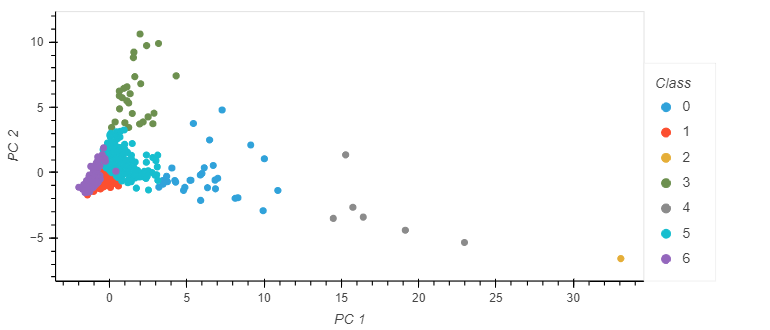

# Sleeper Cities

Project Links -   
[Google Slides Presentation](https://docs.google.com/presentation/d/15fW0W5SNGzy-lnGPs5Vp189S_4UxEftc6y4grR2SSSA/edit?usp=sharing)  
[Tableau Dashboard](https://public.tableau.com/app/profile/joseph.worland/viz/Sleeper_City_Final/Presentation?publish=yes)  
[Presentation Rehearsal](https://drive.google.com/drive/folders/1HkwPEFmjGQGHY2eOadSKgGHQ_FWg8FYj)  

## *Group*

Elard Yong, Joseph Worland, Ryan Meredith, Mark Esposito

## *Objective*

The goal of this repository is to use machine learning to identify cities which are potentially primed for real estate and population growth similar to the likes of which Austin, TX has seen.  Large groups of people working from home while living in high cost-of-living areas are choosing to take their disproportionately large incomes (compared to those incomes in lower cost of living areas) to areas which have similar standards of living with a much lower cost of living.  The southern part of the United States has seen unprecedented growth in the past few years, and our goal is to use machine learning to determine which cities, similar to Austin, TX, are likely to see booms in growth.  We have chosen to use unsupervised machine learning to tackle this task due to the lack of labeled data.  We don’t have a binary metric we are trying to predict, so a clustering algorithm is our best choice to answer our question.

 

## *Data Sources*

The data we have collected comes from a few different sources.  The housing data was provided by [realtor.com](https://www.realtor.com/research/data/) which displays all MLS-- a database established by cooperating real estate brokers to provide information on properties for sale --listed properties across the country, and the income and population data came from [census.gov](https://www.census.gov/quickfacts/fact/table/US/SEX255219). Our university data comes from [unirank](https://www.4icu.org/us/), a website listing all US universities and their rankings.  All of our data came to us in .csv format.

 

## *Data Exploration*

When exploring the raw data for housing information we came across a massive amount of data. For example, the raw housing data contained over 55,000 rows and 40 columns. We took that down to 917 rows and 11 columns. While looking at the data we realized that the roughly 55,000 rows were monthly data points for over 5 years for 917 cities. We cleaned it up to just the year 2019 for those 917 cities. Next we dropped columns that were deemed not necessary for machine learning purposes. We then created a separate data file with the cities, average income, and population. The income and population data was hard coded from the United States census. Once these dataframes were cleaned, they were joined using **pgAdmin**. We also utilized web scraping to gather data on the number of accredited universities and colleges across the USA. We then used excel to do VLOOKUP of the list of cities schools are in and compared that to our list of cities to get a number of schools in each of our cities.  After the individual files are incorporated into a single dataset we will do another join using pgAdmin to create the final dataset to feed the machine learning models. 

 

## *Data Storage & Pipeline*

The data collected from the sources mentioned above gets stored as*.csv* files on a local directory to later be uploaded into *AWS S3* buckets. 

Post setting up our [AWS CLI](https://docs.aws.amazon.com/cli/latest/userguide/cli-chap-install.html), we utilized the [boto3](https://boto3.amazonaws.com/v1/documentation/api/latest/index.html) SDK connection on our *Jupyter Notebook* to load the *.csv* raw data files into our [aws_sleeper_cities](https://github.com/marke0816/Sleeper_Cities/blob/main/jupyter_notebooks/aws_sleeper_cities_final.ipynb) Jupyter notebook as *Panda DataFrame*.   From there we started cleaning and preparing all the datasets. 

Separately, we have created an *AWS RDS* that allows us to store the database on the cloud to later be retrieved using *Postgres* using a *SQLAlquemy* [psycopg2](https://www.psycopg.org/docs/) connection using the following host address:  

Sleeper-cities-db.c5kluwhs2m0u.us-east-2.rds.amazonaws.com   

Here is a snapshot of the connection established with our Database. 

 

Once the tables get loaded into the *Postgres Databases*, we proceed to join the tables in order to come up with our final database *(housing_income_pop_school_data)* that’ll be used for our machine learning model. (screenshot below) 

 

Here is a screenshot of the *Entity Relationship Diagram* that explains the relationship between data we’ll be working with (screenshot below)  

 

Finally, the Postgres database get loaded back into our [aws_sleeper_cities_final](https://github.com/marke0816/Sleeper_Cities/blob/1cff42bfa7049c18ad34913e2823e959132c558c/jupyter_notebooks/aws_sleeper_cities_final.ipynb) Jupyter notebook as *Panda dataframes* in order to be uploaded into our machine learning model. 

 

## *Machine Learning Model*

To help us answer our question previously stated in the Objective, a consensus was made that we would select data sets (i.e. **housing**, **income**, **population**, and **school**) which contain attributes that are considered major influences in determining where people ideally like to settle. Once the datasets were cleaned and joined we loaded them back into jupyter notebook or VS Code and narrowed the number of variables from 14 down to 10 total attributes. These 10 (see image below) were selected because it was determined through trial and error that they provided the model with the optimal validation score (for more info on validation scores see below). 

  

A couple of preprocessing steps have to occur before feeding the model. One, in order to prevent any of the input variables from skewing the model, we performed **StandardScaler** (see below image) to standardize the values of the dataset. 

Secondly, we pass the standardized values into **Principal Component Analysis** (PCA) in order to transform the data from high dimensionality to low dimensionality so we can visually inspect the class output while maintaining meaningful properties of the standardized dataset. (See image below for PCA code)

     

Because the input data is unlabeled and a cluster refers to a collection of data points aggregated together based on certain similarities it was settled that *unsupervised* clustering would yield the desired outcome as we were looking for cities with similarities to Austin. Two different kinds of **Scikit Learn** methods with slightly different characteristics were originally selected to test the classification, but after the implementation of our final data set and further evaluation of the two models with the validation scores, it was decided that the *K-means clustering* model provided the results we looked to obtain. The below descriptions include limitations and benefits as well as 2D, 3D images, and classifications generated by the respective ML method.

### **K-means Clustering**:

We have chosen to run K-means clustering as it is the most well known and documented clustering method. This specific ML method generates “centroid’s” that serve as the mean of the expected cluster and then partitions the data points into clusters based on each data point with the closest Euclidean distances to that centroid. K-means allows the ability to determine the optimal number of clusters (K) using the **Elbow** method (see below caption and image). The elbow method lets us visually see when the distortion/inertia start to decrease in a linear fashion (i.e. when the curve starts to flatten). Alternatively having to use “best judgement” when selecting the number of clusters can be considered a limitation as the user/users might select too many or not enough clusters for the modeling leading to over/under fitting of the data. 

To start with we set the K-value equals 5.

Below scatter plots allow us to visibly inspect the output data based on classes. A 2D scatter plot gives us a quick glance at how the data is distributed, and  A  3D model will give a clearer picture of how the clusters are distributed within the densely stacked data points.  

 
#### **Validation Models**:

Another obstacle to overcome compared to supervised ML models is that because there is no “ground truth” to the dataset being feed into the model, there is no automatic calculable way to find the accuracy score for unsupervised ML models, but there are three common validation models (i.e. **Silhouette Coefficient**, **Calinski Harabasz Score **, and **Davies-Bouldin Index**) to help us interpret the performance of the K-Means clustering. Click [here](https://medium.com/@haataa/how-to-measure-clustering-performances-when-there-are-no-ground-truth-db027e9a871c) to follow a link for quick description of the validation models listed above. These models adapt varying sums, means, and ratios of the Euclidean distance of data points within each cluster and the Euclidean distance of clusters from one another to evaluate the grouping. We used a combination of the validation models, 2D, and 3D scatter plots to train the ML model by reducing or increasing the number of attributes that were incorporated, while simultaneously increasing and decreasing the number of clusters the ML model used to group the data points by. After several iterations, a K-value of 7 (see image below) provided the model with the best performance and defined clusters for our dataset. The image also contains the validation scores for reference. 

Once the K-means method has generated its respective clusters, we then incorporate the **classifications** with the original dataset so the true values prior to standardization are joined and exported as a .CSV file. With this dataset we can then see which cities were clustered with Austin, TX and compare the original value for housing, income, population, and school to see if these do indeed share similar traits or have varying values in order to validate even further the clustering methods.

The below image is a screenshot of the dataframe with the total number of cities and 10 of the 30 individual cities grouped based on the K-means clustering methods. We believe based on the original dataset values, in combination with the validation model, that the machine learning model provided us with an accurate list of cities with the potential for growth similar to what Austin, TX has experienced in the past few years.

 

 

## *Dashboard*

We made the decision to use Tableau to display our data for this project. We like the versatility in the different types of visualizations that Tableau provides and how easy it is to maneuver between them. 

For the Tableau dashboard, please click [here](https://public.tableau.com/app/profile/joseph.worland/viz/Sleeper_City_Final/Presentation?publish=yes) to visit the public site.

 
We connected three different data sources to tableau. We have our initial data without any machine learning, we have our data after machine learning with clusters, and then we have our specific Austin cluster.
 
 
 
 
We decided to use several different types of visualizations that we think show the effectiveness of our model. We start out with a map of all our cities for which we have data. This map, and all other visualizations, have a couple different ways to interact with them. You can select the data you want to see in a couple different ways. There is a search bar where you can put in the specific city, you can select a specific city or data point with a mouse click, or you can click and hold and select multiple cities or data points.
 
 
 
 
We also used a couple different types of bar graphs, nested graphs, and line graphs to showcase the rest of our data.
 
 
 
 

## *Project Continuation Recommendations* 

We had the intention of bringing in more data to cover different features. We looked into getting weather data and data from Yelp that would cover restaurants, entertainment venues, and healthy living (gyms, pools, parks, etc.). When we found the data, it was in massive files and difficult to process. We had to decide if we wanted to move on with the data we already had or potentially struggle to be ready to present. We chose to use the data we currently had, but held on to the Yelp and weather data for future build outs of this project. We would also like to gather more historical data to be able to show trends.

If we were to restart the project now we would have worked on a website as well as the Tableau dashboard to showcase our data. We would like to have a website where you can search different city attributes that interest you and would in turn receive a list of cities that had that attribute. This could be useful not only for where to relocate, but also just for where to go on vacation.

## *Conclusion* 
 
While working with all the data for the 30 cities, we saw several cities and metro areas repeatedly pop up in close proximity to Austin. Those five areas are the Baltimore, Charlotte, Nashville, Phoenix, and Portland metro areas.
 
We believe that all 30 cities have common enough features to say that there is a lot of growth potential, but those 5 metro areas have the most in common with Austin and, therefore, have the most growth potential.
