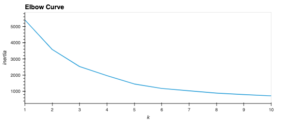

# Sleeper Cities

## *Group*
Elard Yong, Joseph Worland, Ryan Meredith, Mark Esposito

## *Objective*

The goal of this repository is to use machine learning to identify cities which are potentially primed for real estate and population growth similar to the likes of which Austin, TX has seen since the beginning of the "work from home" trend.  Large groups of people working from home while living in high cost-of-living areas are choosing to take their disproportionately large incomes (compared to those incomes in lower cost of living areas) to areas which have similar standards of living with a much lower cost of living.  The southern part of the United States has seen unprecedented growth in the past few years, and our goal is to use machine learning to determine which cities, similar to Austin, TX, are likely to see booms in population growth.

## *Communication Protocol*

Our group communicates mainly through our slack direct messages.  We also share data and ideas through a google drive set up by Elard.  Joseph has also set up a recurring zoom meeting for every day at 11 am CST so that we may discuss our project.

## *Data Sources*

The data we have collected so far has come from a few different sources.  The weather data was downloaded from kaggle, the housing data was provided by a realtor friend of Joseph's, and the income data came from census.gov.

## *Data Storage*

The data is loaded into pandas dataframes using jupyter notebooks and then uploaded to MongoDB via pymongo.

## *The ML Model*

### Kmeans Clustering

We have chosen to run Kmeans clustering as a first pass with our data.  The images shown below depict the clustering labels with K = 5.

This K-value was chosen using the elbow curve below.

### Affinity Propagation

### Hierarchical Agglomerative Clustering

